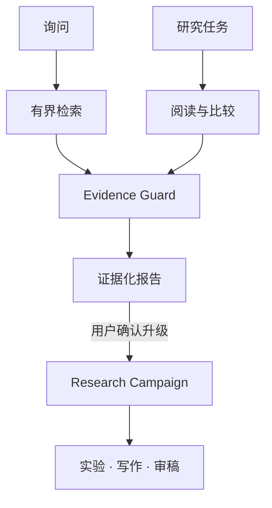

<div align="center">

# EAI Desktop

**把日常询问、证据调查、论文脉络与研究实验放进同一个本地工作台。**

[](https://github.com/zGuanZhe/EAI/releases/latest)

[](LICENSE)


[下载 v1.0](https://github.com/zGuanZhe/EAI/releases/latest) · [产品介绍](docs/INTRODUCTION.md) · [系统架构](docs/ARCHITECTURE.md) · [发布说明](docs/RELEASE_NOTES_1.0.0.md)

</div>

---

EAI Desktop 是面向个人研究者的本地优先科研工作台。它不是另一个只有聊天记录的 AI 窗口，而是把当前问题、线程上下文、Atlas、论文全文、个人判断、Canvas 和实验 Campaign 组织成一条可追踪、可核验、可撤销的研究工作链。

## 从问题到研究成果



### 询问

处理日常问题、快速解释和文本转换。信息型问题检索允许的本地、Atlas、学术和网页来源；闲聊、改写与翻译不搜索，也不修改工作区。

### 研究任务

面向文献调查、证据比较和研究综述。任务在后台完成界定、检索、阅读、比较、引用核验和报告生成，可独立暂停、恢复、取消和定向追加要求。

### Research Campaign

把证据和可检验假设推进到实验、写作、三角色审稿与修订。Docker 会话、阶段跃迁和持久晋升分别审批。

### 系统操作

保存资料、更新 Canvas 或对象记忆时，只调用已注册能力并先生成 OperationBatch 预览；提交需要用户确认和 revision 检查，成功后保留 receipt 与安全撤销。

## 为什么它不只是聊天

- **上下文是可见的**：每轮运行保存 `ContextManifest`，记录实际可见对象、revision、来源层、信任等级和内容 hash。
- **搜索是真实动作**：信息型询问必须产生实际 search capability，或明确显示连接器不可用；模型不能自行声称“已经联网”。
- **引用会 fail closed**：Evidence Guard 无法核验引用定位或证据充分性时，只交付证据缺口和补救动作。
- **Agent 权限有边界**：Agent 不接触 SQL、数据库文件、密钥、DOM、任意宿主路径或宿主命令。
- **写入可以追责**：持久修改经过预览与确认；拒绝、冲突或预检失败保持权威数据零写入。

> [!IMPORTANT]
> Evidence Guard 核验的是引用定位和证据充分性，不等同于证明事实本身绝对真实。模型固有知识不算来源，只有转化为 `SourceRecord` / `EvidenceChunk` 的内容才能被引用。

## 下载与安装

下载 [**EAI-Desktop_1.0.0_x64-setup.exe**](https://github.com/zGuanZhe/EAI/releases/download/v1.0.0/EAI-Desktop_1.0.0_x64-setup.exe)，支持 Windows 10/11 x64。

```text
SHA-256  7B88CDD85518872FFF9197190E59E91BFFF9953A13D239D9C8B0B6FFED80D61E
大小      75,909,325 bytes
```

安装包当前未代码签名，Windows 可能显示 SmartScreen 提示。只应从 `github.com/zGuanZhe/EAI` 的正式 Release 下载。

```powershell
Get-FileHash -Algorithm SHA256 '.\EAI-Desktop_1.0.0_x64-setup.exe'
```

> [!NOTE]
> 应用数据保存在 `%APPDATA%\com.eai.desktop`，Provider Key 保存在 Windows Credential Manager。v1.0 不支持降级到实验性 0.x 包；变更主版本前请备份完整 AppData。

## 模型与搜索

模型通道和网页搜索是两项独立配置。OpenAI-compatible 端点只负责模型推理，EAI 不假设它自带网页搜索。

| 配置 | 支持范围 | 密钥位置 |
|---|---|---|
| 模型 Provider | OpenAI-compatible、OpenRouter；Chat Completions 或 Responses API | Windows Credential Manager |
| 本机中转 | `http://127.0.0.1:PORT/v1`；HTTP 只允许 loopback | Windows Credential Manager |
| 通用网页搜索 | SearXNG、Brave Search、Tavily | SearXNG 可无 Key；其他 Key 存 Credential Manager |
| 学术连接器 | OpenAlex、arXiv、Crossref，可选 Semantic Scholar | 按连接器配置 |

Composer 的来源控件决定本轮 SourcePolicy，默认是“全部可用来源”。发送前摘要会显示实际允许的上下文、来源与修改边界；Run Center 的“Agent 能力”视图显示注册能力、权限类别和连接器健康。

> [!WARNING]
> SourcePolicy 控制证据来源与搜索，不会阻止对已配置远程模型的推理请求。敏感内容必须完全留在设备内时，应使用本机 loopback 模型 Provider。

<details>
<summary><strong>展开模型与网页搜索配置步骤</strong></summary>

1. 从左侧导航打开“设置”。
2. 在“模型 Provider”中填写 Base URL、模型名称、API 格式和 Key。
3. 普通 `/chat/completions` 中转选择 Chat Completions；实现 `/responses` 的端点选择 Responses API。OpenRouter 预设使用 Chat Completions。
4. 保存后，桌面端会重启 sidecar 并重新获取运行时状态。发送一个简单询问验证模型连接。
5. `401/403` 通常表示 Key 或上游权限错误；`404` 通常表示 Base URL/API 格式不匹配；模型不存在错误应检查模型名称。
6. 如需通用网页搜索，在“网页搜索”中选择 SearXNG、Brave 或 Tavily，然后点击“检查连接”。

SearXNG 填写实例根地址，EAI 会请求其 `/search` JSON 接口。本地实例可用 `http://127.0.0.1:8080` 且不需要 Key；远程实例必须使用 HTTPS。Brave 和 Tavily 使用官方默认 API 地址及各自控制台签发的 API Key。

</details>

## 数据与执行边界

| 边界 | 保证 |
|---|---|
| 本地 API | 随机 loopback 端口，每次启动生成独立 `X-EAI-Session` 令牌 |
| 密钥 | 不进入 JSON、日志、事件、前端存储或 Git |
| 网页读取 | 拒绝私网地址、凭据 URL、本地文件、危险重定向和超限正文 |
| 实验执行 | Docker 不可用时只生成预览，绝不回退到宿主执行 |
| 权威数据 | SQLite transaction 提交实体与 `projection_journal`；JSON 是可失败、可重放的最终一致投影 |
| 取消 | UI 立即进入终态；晚到 Provider、工具和网页结果不能再写入消息、来源或业务数据 |

远程模型会收到完成本轮所需的消息、允许上下文和筛选证据；搜索连接器会收到查询词；目标网页会收到正常 HTTPS 请求。第三方服务的保留与隐私政策由对应 Provider 控制。

## 技术结构

```text
Tauri 2 / Windows
└── React 19 + Vite 7
    └── FastAPI sidecar
        ├── Agent v3 AskTurn / ResearchTask
        ├── Agent runtime / capability registry
        ├── Research Store / Evidence Guard
        └── Campaign / Docker sandbox
```

```text
apps/web                    产品 UI
apps/desktop/src-tauri      Tauri Windows 桌面壳
services/api                FastAPI sidecar 与领域服务
resources/atlas-cache       只读 Atlas 资源
third_party/ai-scientist-v2 固定版本的 AI Scientist v2 派生组件
```

<details>
<summary><strong>展开本地开发与发布验证</strong></summary>

需要 Node.js、Python、Rust 与 Windows WebView2。完整 Campaign 执行还需要 Docker Desktop。

```powershell
git clone https://github.com/zGuanZhe/EAI.git
cd EAI
npm ci
npm run bootstrap
npm run dev
```

```powershell
npm run verify
npm run desktop:build
npm run desktop:smoke
```

自动化测试只使用 `runtime/` 或操作系统临时目录，不读取真实用户数据。安装包生成于 `apps/desktop/src-tauri/target/release/bundle/nsis/`。

</details>

## 文档

| 文档 | 内容 |
|---|---|
| [产品介绍](docs/INTRODUCTION.md) | 交互模式、上下文优势、权限与隐私边界 |
| [产品定义](docs/PRODUCT.md) | 核心对象、主循环和验收标准 |
| [系统架构](docs/ARCHITECTURE.md) | 进程、数据、模块和事务边界 |
| [迁移与数据安全](docs/MIGRATION.md) | schema、备份、投影和恢复规则 |
| [验证记录](docs/VALIDATION.md) | API 契约、测试与安装 smoke |
| [开发交接](docs/HANDOFF.md) | 当前实现状态和后续边界 |

## License

EAI Desktop 源代码采用 [MIT License](LICENSE)。`third_party/ai-scientist-v2` 保留其上游许可证与 EAI 派生说明，分发时必须一并保留。
